---
hide:
  - navigation
  - toc
---

# Retirement Risk Lab

**An offline Monte Carlo retirement simulator for Mac, iPad, and iPhone.**

You define a retirement scenario — current age, balance, spending, contributions, Social Security, taxes, RMDs — and the app runs thousands of simulated futures to estimate the probability your money lasts to the age you care about.

Everything runs on-device. No accounts. No telemetry. No cloud dependency for the math itself.

  <a href="#coming-soon" style="display: inline-block; padding: 14px 28px; background: #000; color: #fff; border-radius: 12px; text-decoration: none; font-weight: 500;">
    Coming soon to the App Store
  </a>

---

## What you actually get

> *There is a 49.4% chance your money lasts to age 95.*
>
> *About 50.6% of simulated futures ran out before then. Among futures that ran out, the typical run-out was around age 85; in the unluckiest 10% of futures, money ran out by age 79.*

A single, clear answer — backed by a Wilson 95% confidence interval and a precision label so you know how much to trust it. Then four chart tabs that let you actually understand what the simulator did:

- **Survival by Age.** The probability your portfolio is still solvent at each age, with the confidence band.
- **Balance Range.** Lucky, typical, and unlucky balance paths over the simulation horizon.
- **Path Table.** The same data as the chart, in a sortable table you can export to CSV.
- **Math.** The exact formulas, the locked operation order, and a worked example with your actual inputs substituted in. Auditable.

---

## How the simulation works

Every "trial" inside the simulation walks your portfolio forward, year by year, from your current age to your end age:

1. Adds your annual contribution (until you retire).
2. Draws a random return for the year (normal distribution, your mean and standard deviation).
3. Applies the return.
4. Subtracts your spending (grossed up for taxes if enabled), the RMD floor if applicable, and adds Social Security income if it's started.
5. Records whether you still have money at the end of the year.

After thousands of trials, the app counts how many futures still had money at your end age. That's your survival probability.

The randomness comes from one place — the per-year return draw — so a lucky future has a string of good years, an unlucky one has a string of bad years, and **sequence-of-returns risk** is captured by sampling the full range. Set a fixed random seed and you get bit-identical results on the same build, every time.

---

## On every device you already own

The app is universal: **macOS 14+ on Mac, iPadOS 17+ on iPad, iOS 17+ on iPhone.** Same simulation engine, same numbers, layout adapted to each screen.

### On Mac

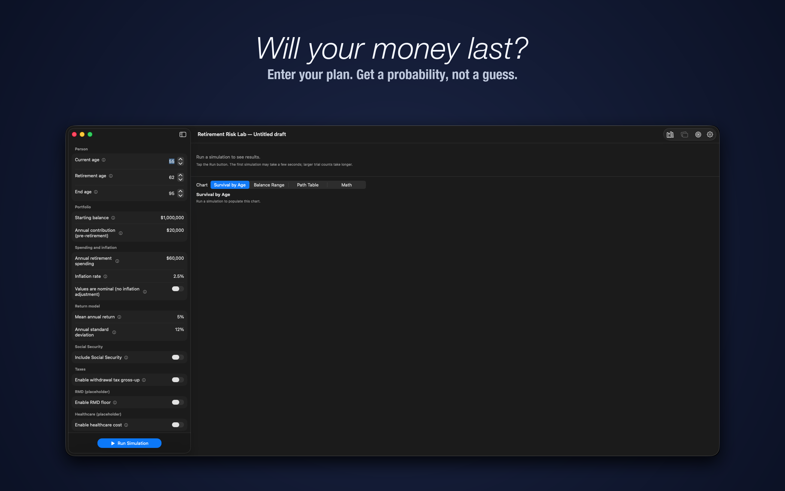{ loading=lazy }
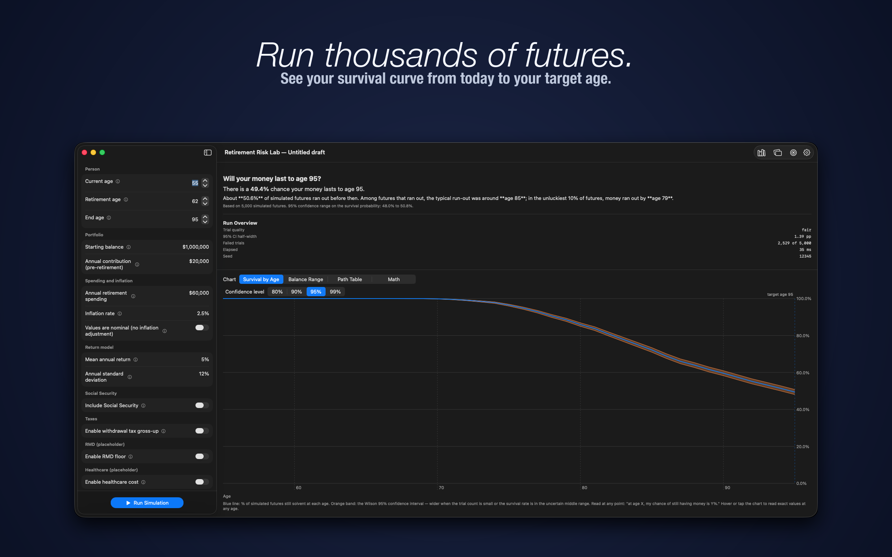{ loading=lazy }
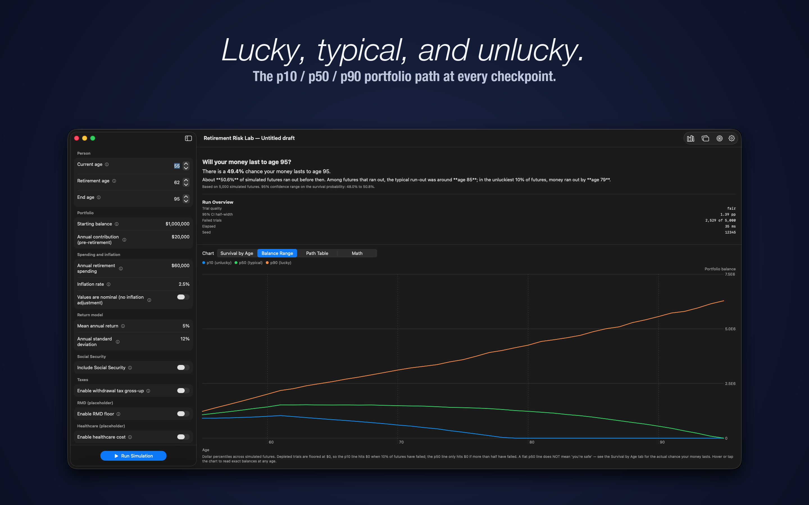{ loading=lazy }
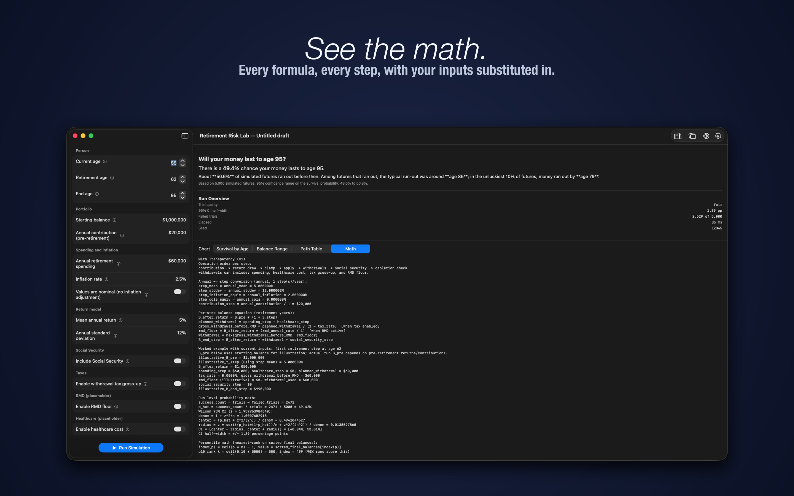{ loading=lazy }
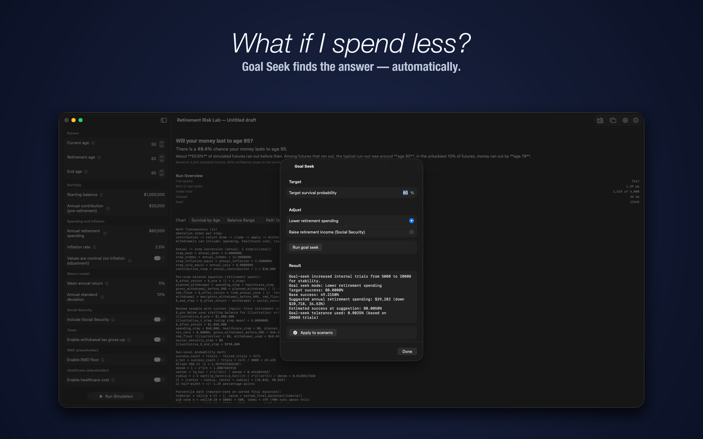{ loading=lazy }

### On iPad

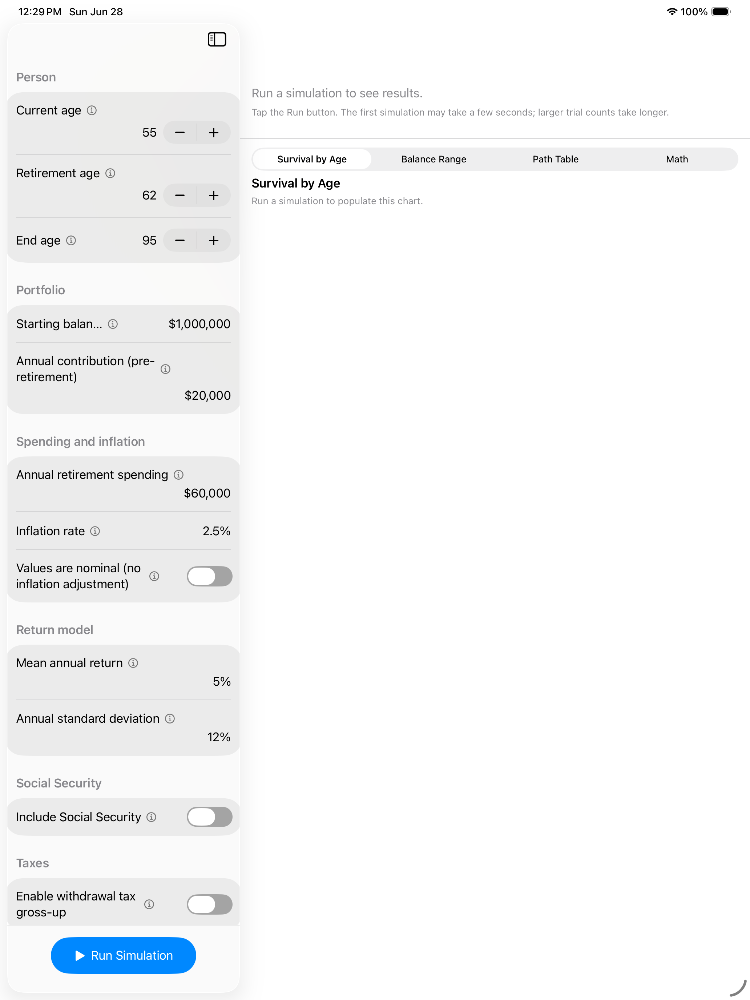{ loading=lazy width=400 }
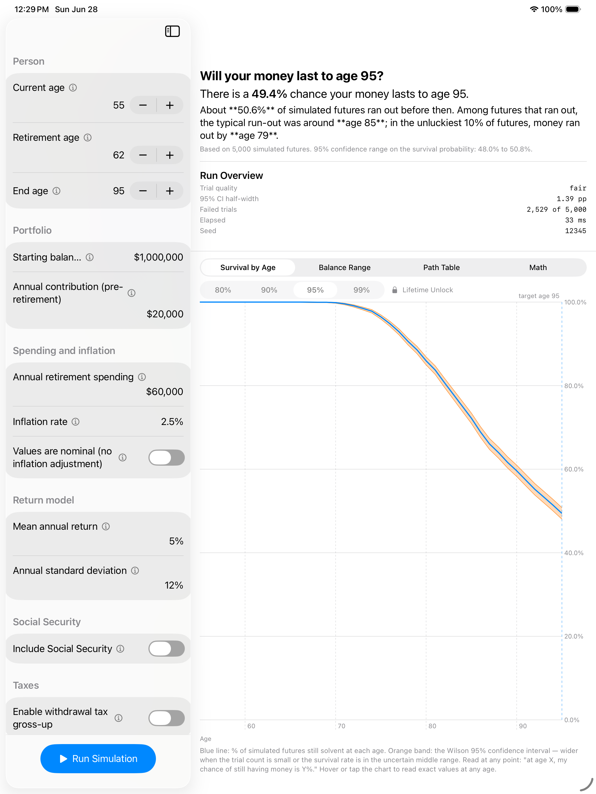{ loading=lazy width=400 }
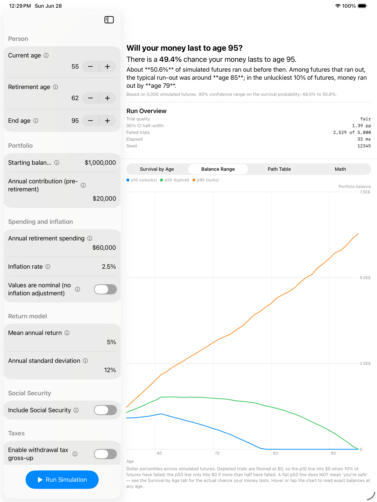{ loading=lazy width=400 }
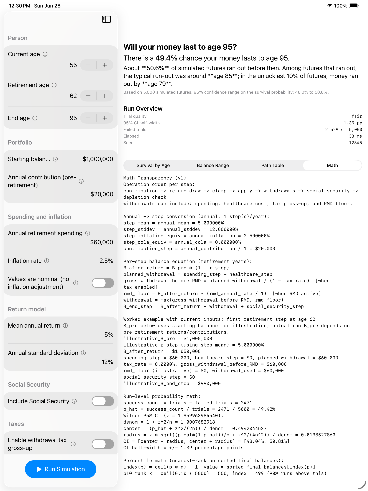{ loading=lazy width=400 }

### On iPhone

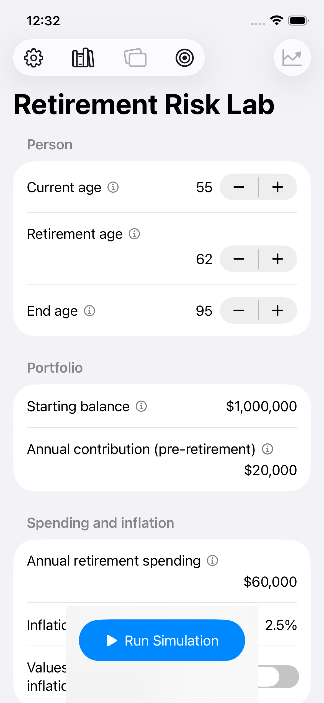{ loading=lazy width=240 }
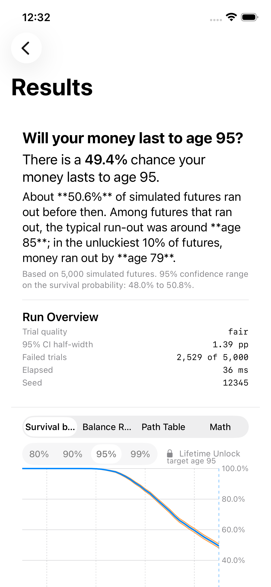{ loading=lazy width=240 }
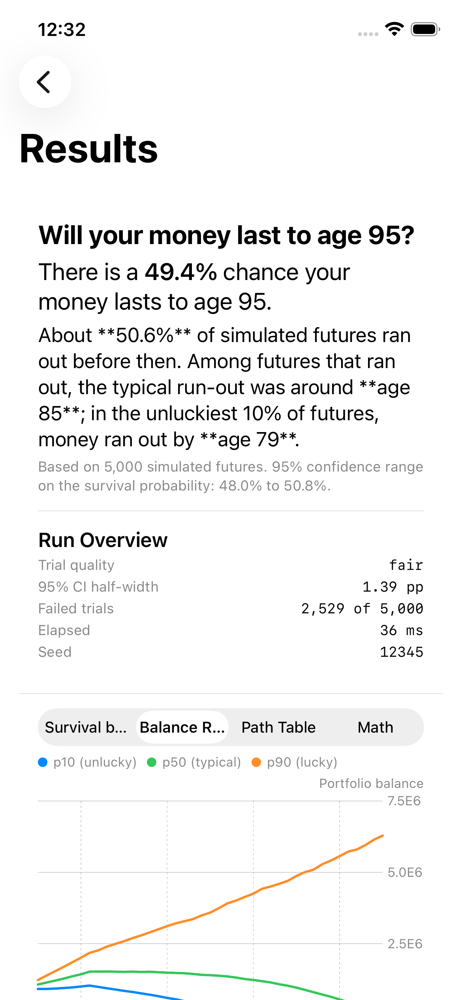{ loading=lazy width=240 }
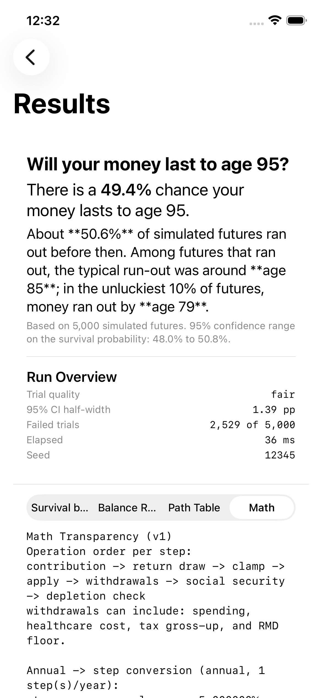{ loading=lazy width=240 }

---

## Free or Lifetime — your call

The simulator is **fully free for the core question**: will my money last to age N? You get the headline survival probability, the confidence interval, the Survival, Balance Range, Path Table, and Math tabs, up to 5,000 trials per run. That alone covers the planning question most people came to ask.

**Lifetime Unlock** adds the deeper analysis features once you start running real scenarios against your own numbers:

| | Free | Lifetime Unlock |
|---|:---:|:---:|
| Headline survival probability + 95% CI | ✓ | ✓ |
| Survival, Balance Range, Path Table, Math tabs | ✓ | ✓ |
| Up to **5,000 trials** per run | ✓ | ✓ |
| **Named scenario library** (Save / Load) | | ✓ |
| **iCloud sync** across your devices | | ✓ |
| **Compare two scenarios** — overlay survival curves | | ✓ |
| **Goal Seek** — solve for the spending or savings level that hits your target | | ✓ |
| **Monthly timestep** — resolve depletion month, not just year | | ✓ |
| Up to **2,000,000 annual / 410,000 monthly** trials | | ✓ |
| **Adjustable confidence level** — 80% / 90% / 95% / 99% | | ✓ |
| **Path CSV export** for downstream analysis | | ✓ |

**Lifetime Unlock is a one-time $24.99 purchase** (US storefront — local pricing varies). **Family Sharing is enabled**, so the unlock covers everyone in your Family Sharing group at no extra cost. No subscription. No recurring charges.

  <a href="#coming-soon" style="display: inline-block; padding: 14px 28px; background: #000; color: #fff; border-radius: 12px; text-decoration: none; font-weight: 500;">
    Coming soon to the App Store
  </a>

---

## Privacy

Your scenarios and run results stay on your device. The app never sends them anywhere unless you turn on iCloud sync — and even then, the data travels only between *your* devices via your Apple ID's private CloudKit container. There is no developer-controlled cloud, no analytics, no telemetry, no advertising SDK.

[Read the full privacy statement →](privacy.md){ .md-button }

---

## Documentation

A full user guide ships with the app and is also published here. It covers every input field, every chart, the simulation conventions, suggested settings by planning posture, and a historical-assumptions reference grounded in 151 years of Shiller dataset returns.

[Read the user guide →](manual.md){ .md-button }

---

## Frequently asked questions

??? question "Is it really fully offline?"
    Yes for the simulation itself. The numbers your simulator produces never leave your device. Two narrow exceptions: **(1)** the App Store handles purchases and IAP entitlement through Apple's StoreKit, like every iOS/macOS app; **(2)** if you turn on iCloud sync for your scenario library (Lifetime), CloudKit moves your saved scenarios between your own devices via Apple's private database — Apple sees only encrypted blobs, the developer never sees them at all.

??? question "Can I reproduce an exact result?"
    Yes. Switch the seed mode to **Fixed**, pick a seed, and the same build on the same platform produces bit-identical results every run. Useful when you want to A/B-test one assumption change without random noise polluting the comparison.

??? question "What's the math model?"
    A parametric normal Monte Carlo: returns are i.i.d. normal draws each year (or month) using your mean and standard deviation. We use **xoshiro256\*\*** with SplitMix64 seeding and Box-Muller normal generation. The full operation order per step (contribution → return draw → clamp → apply → withdrawals → Social Security → depletion check) is locked and documented in the Math tab.

??? question "Does it replay historical sequences?"
    Not by default. The current engine uses a parametric normal model, which does **not** reproduce serial correlation, fat tails, or volatility clustering observed in real markets. The user guide's Appendix A gives you historical-era inputs (Stagflation, Great Depression, Lost Decade, etc.) so you can stress-test against specific regimes — but each year is still drawn independently.

??? question "Is this financial advice?"
    No. Retirement Risk Lab is a statistical simulation tool for scenario analysis and planning support. The outputs are probability estimates under stated assumptions, not guarantees or investment recommendations. Past market behavior does not guarantee future results.

??? question "What about taxes and RMDs?"
    The withdrawal tax gross-up applies a single effective tax rate. The RMD floor enforces a minimum withdrawal at the SECURE-2.0 age (73 for those born 1951–1959; 75 for 1960+). Both are simplifications relative to a full tax-law engine; the user guide explains exactly how they work and when they affect the answer.

??? question "What about long-term care, healthcare, Social Security taxation?"
    The Healthcare field adds a separate line to retirement spending, treated mathematically the same way as ordinary spending. Social Security is modeled with start age, COLA growth, and (optionally) the gross benefit before Medicare deductions — the user guide explains how to avoid the common Medicare-from-Social-Security double-count.

??? question "When will it be available?"
    The app is in the final stages of review for the App Store. We'll update this page with a direct App Store link the moment it goes live. If you'd like to be notified, file an issue on the [GitHub repo](https://github.com/ether-ore/RRLsite) and watch the README — that's where the launch announcement will land first.

---

*Retirement Risk Lab is a statistical simulation tool for scenario analysis and planning support. Outputs are probability estimates under stated assumptions, not guarantees or investment advice. Past market behavior does not guarantee future results.*
