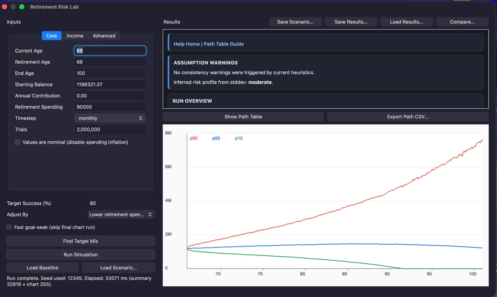

# Retirement Risk Lab

**Retirement Risk Lab** is an offline Monte Carlo retirement simulator for macOS, iPadOS, and iPhone.

You define a retirement scenario — current age, balance, spending, contributions, Social Security, taxes, RMDs — and the app runs thousands of simulated futures to estimate the probability your money lasts to the age you care about.

The simulation runs entirely on-device. No telemetry. No accounts. Available on the Mac App Store and the iOS App Store.

{ loading=lazy }

---

*This site is being rebuilt. More content arriving soon.*
